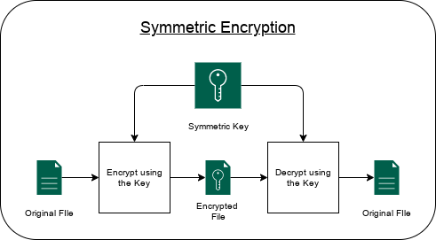
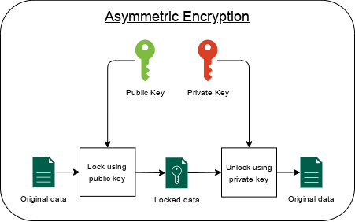
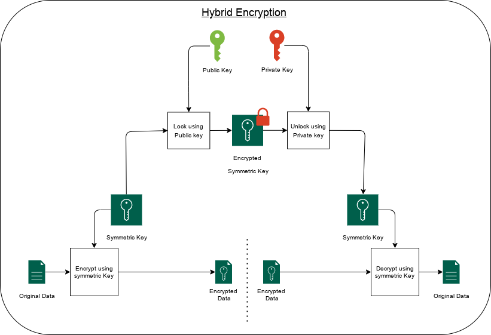
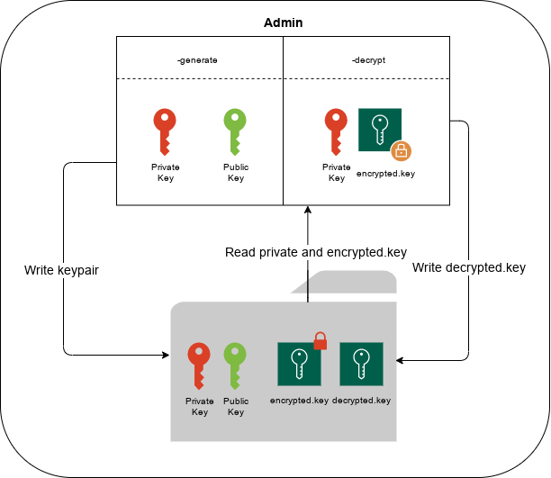

# FrostBite

If you want instructions on how to use the software, and aren't interested in how it works go straight to the [How to use it?](#how-to-use-it-) section.

- [FrostBite](#frostbite)
  - [What is FrostBite? 🥶](#what-is-frostbite-)
    - [So what is special with Frostbite? 💎](#so-what-is-special-with-frostbite-)
      - [Cross-platform and cross-architecture support 🖥️](#cross-platform-and-cross-architecture-support-️)
      - [Performance 🚀](#performance-)
      - [Public key cryptography 🔑🗝️](#public-key-cryptography-️)
  - [How does the technology behind it operate? 🧠](#how-does-the-technology-behind-it-operate-)
    - [Overview 📚](#overview-)
    - [Symmetric vs Asymmetric encryption](#symmetric-vs-asymmetric-encryption)
      - [Symmetric](#symmetric)
      - [Asymmetric](#asymmetric)
    - [Hybrid encryption](#hybrid-encryption)
  - [How does it work? ⚙️](#how-does-it-work-️)
    - [Scanning files 🔎](#scanning-files-)
    - [Locking 🔑](#locking-)
    - [Getting the decryption key](#getting-the-decryption-key)
    - [Unlocking 🔓](#unlocking-)
  - [How to use it? 📖](#how-to-use-it-)
    - [IMPORTANT ⚠️](#important-️)
    - [Building from source vs using prebuilt binaries (Advanced users) 🧰](#building-from-source-vs-using-prebuilt-binaries-advanced-users-)
    - [Creating public and private keys 🔑](#creating-public-and-private-keys-)
      - [Windows generating key pairs 🪟](#windows-generating-key-pairs-)
      - [Linux generating key pairs 🐧](#linux-generating-key-pairs-)
    - [Locking files 🔒](#locking-files-)
      - [Prerequisites 📋](#prerequisites-)
      - [Locking one folder/directory 📁](#locking-one-folderdirectory-)
      - [Locking the whole system 🌎](#locking-the-whole-system-)
    - [Unlocking files 🔓](#unlocking-files-)
      - [Getting the `decrypt.key`](#getting-the-decryptkey)
      - [Using the `decrypt.key`](#using-the-decryptkey)
    - [Limitations](#limitations)
  - [Use cases; Why have I made it? 🤔](#use-cases-why-have-i-made-it-)
  - [Future plans 📝](#future-plans-)
    - [Config file](#config-file)
    - [Admin](#admin)
    - [FrostBite (main program)](#frostbite-main-program)

## What is FrostBite? 🥶

Frostbite is a file encryption software targeting activists, journalists, and anyone who needs their data protected in transit.

### So what is special with Frostbite? 💎

#### Cross-platform and cross-architecture support 🖥️

Being written in Go, FrostBite can easily be compiled and run on Linux as well as Windows systems. It supports x64 as well as x86 for older systems, on Linux it even supports ARM for both 64 and 32 bit systems.

Besides the binary itself, it automatically detects if it's run on Linux or Windows and adjusts the directory scanning accordingly.

#### Performance 🚀

Besides Go being in the C neighborhood when it comes to performance, there a few more tricks that FrostBite uses to gain an edge.\
While scanning the system, each disk is designated to a separate Go worker which for simplicity can be thought of as a separate CPU thread. That means that as long as your system has more CPU threads (Usually 2x more than CPU cores) than disks, scanning will take as much time as the slowest disk read time.

Encryption and decryption use the same approach and delegates each file to a separate worker. Number of workers is limited to avoid freezing the system and hogging all the resources, but on HDD systems the bottleneck will probably be the disk anyways.

#### Public key cryptography 🔑🗝️

Unlike regular encryption software with which you can lock and unlock your files using the same password/key, frostbite generates a new key on each run. The "new key for each lock" makes it impossible to prepare the unlock key in advance and can delegate the Locking and Unlocking to separate parties.

## How does the technology behind it operate? 🧠

### Overview 📚

This project consists of 2 separate programs that work as one system. Those are the **Admin** and **FrostBite** itself.

🤵‍♂️ **Admin** is used to generate the keys and should be kept on a separate system together with the Private Key.

🥶 **FrostBite** is the part that encrypts (locks) the files, the same program is used to unlock the files after acquiring the AES key (password). The unlocking part will be discussed in detail.  
[🔝Go to top](#frostbite)

### Symmetric vs Asymmetric encryption

To understand Hybrid cryptography which this project is based on, we first need to refresh our knowledge on Symmetric and Asymmetric cryptography and remind ourselves why they are amazing.

#### Symmetric

**Symmetric encryption** is the most common and wide-spread kind of encryption. It uses only one secret key to cipher and decipher the data. The secret key can be provided by a user and treated as a standard password, or it can be randomly generated.

It's **advantage** is it's simplicity of having only one static key and the ability to encrypt large amounts of data, making it perfect for file encryption.

It's **disadvantages** is that there is no safe way to transport the key. If you want to send an encrypted message, you would need to send the key along with it so that the receiver can read it. Sending the key defeats the purpose of encrypting it in the first place.

#### Asymmetric

Asymmetric encryption is also known as public key cryptography, which is a relatively new method, compared to symmetric encryption. Asymmetric encryption uses two keys to encrypt a plain text. Secret keys are exchanged over the Internet or a large network. It ensures that malicious persons do not misuse the keys. It is important to note that anyone with a secret key can decrypt the message and this is why asymmetric encryption uses two related keys to boosting security. A public key is made freely available to anyone who might want to send you a message. The second private key is kept a secret so that you can only know.

Asymmetric encryption takes a different approach. Instead of having a single key for encrypting and decrypting, we generate a key pair consisting of a Private key, and a Public key. Public key is used only for encrypting the message, and the private key is used only for decrypting the message.

**How is asymmetric encryption used?**
The public key is given to anyone who wishes to send us a message, and upon receiving it we are free to decrypt it using our private key. The private key should NEVER ever be made available to the public

A message that is encrypted using a public key can only be decrypted using a private key, while also, a message encrypted using a private key can be decrypted using a public key. Security of the public key is not required because it is publicly available and can be passed over the internet. Asymmetric key has a far better power in ensuring the security of information transmitted during communication.

[🔝Go to top](#frostbite)

### Hybrid encryption

Using both asymmetric and symmetric encryption methods. A secret key is generated and the data are encrypted using the newly generated key (symmetric method). The data are sent to the recipient along with the key via the public key method (asymmetric method). Recipients use their private key to decrypt the secret key, which is then used to decrypt the message. See cryptography.

---
[🔝Go to top](#frostbite)

## How does it work? ⚙️

Each the program is run it generates a new AES key and encrypts it using the RSA public key. The encrypted AES key is then saved to each directory in a file named `encrypted.key`. The `encrypted.key` file can be unlocked using the Admin program, after which the AES key is decrypted and the files can be unlocked.

Let's take a look at the process in more detail.

### Scanning files 🔎

FrostBite scans the system for files that are not already encrypted. If a file is already encrypted, it will be skipped. The scanning is done in a separate thread and is not blocking the main thread. The scanning is done in a way that it will not freeze the system, while delivering maximum performance. In the process of scanning, `encrypted.key` files are generated in each directory for purpose of redundancy. We will go into more detail about the `encrypted.key` file later, after we discuss the encryption process.

The scan always checks if the user has sufficient permissions to read the file. If the user does not have sufficient permissions, the file will be skipped.

### Locking 🔑

When the program starts, one of the first things that it does is to generate a new Symmetric key (AES). This key will be used to encrypt the files. The AES key is then encrypted using the Public Key (RSA) and the result is saved to each directory in a file named `encrypted.key` during scanning process, as mentioned above.
After running the scan and getting the list of files, the program will start encrypting them. The encryption is done in a separate thread and is not blocking the main thread, it is accomplished by creating a Goroutine for each file. The number of Goroutines depends on the number of CPU cores. The encryption is done in a way that it will not freeze the system, while delivering maximum performance. The encryption is done using AES-256.

### Getting the decryption key

The decryption key is generated by the Admin program. The Admin program is used to generate the keys and should be kept on a separate system together with the Private Key. The Admin program is a simple CLI program that takes the input of the Private key from the `keys/private.key` file and the `encrypted.key` file from the directory that the user wishes to unlock.
The Admin program then decrypts the `encrypted.key` file and outputs the AES key `decrypted.key` file. The `decrypted.key` file is then used by the FrostBite program to decrypt the files.

### Unlocking 🔓

The unlocking process is very similar to the locking process. The only difference is that the AES key is read from the `decrypted.key` which we generated using the Admin program from the `encrypted.key` file.

Like with locking, all files are scanned first and checked if they are '.enc' and if the user has sufficient permissions to read and write to the file. Then FrostFire will decrypt the files using AES key from the `decrypted.key` file found in the same directory as the file. It uses the same performance optimization techniques as the locking process.
After finishing, all the '.enc', `encrypted.key` and `decrypted.key` files are deleted, leaving the system in the same state as before the program was run.

[🔝Go to top](#frostbite)

## How to use it? 📖

### IMPORTANT ⚠️

Keep private key on a different system and NEVER copy/generate it on the system you wish to lock.

### Building from source vs using prebuilt binaries (Advanced users) 🧰

Binaries for all supported systems can be found under "Releases" section of this repository.

If one wishes to build from source, simply run `build.sh` to build for all systems. Or, manually build `main.go` and `Admin/main.go`. The difference is that by building it yourself, you have the option to embed a Public Key in the binary itself. Just put the public.key that you generated using Admin to key directory making it `key/public.key`. Using this method, you can distribute just the binary without having to worry about the public key distribution. Ideal for working with a team or in a corporate environment.

### Creating public and private keys 🔑

Creating key pairs is simple but requires the user to run instructions in the command line. New users might be intimidated but there is no need, as it is very simple. If sufficient demand is shown, I will create a GUI for this part.

#### Windows generating key pairs 🪟

For Windows open powershell or cmd in the folder where Admin.exe is located. Run it with the flag --generate, example: `./Admin.exe --generate`. It will ask you if you are sure you want to generate the files as it will overwrite the old ones. `public.key` and `private.key` will be saved to keys folder.

#### Linux generating key pairs 🐧

To generate key pairs in linux navigate to where the Admin binary is located and run `Admin --generate`. It will ask you if you are sure you want to generate the files as it will overwrite the old ones. `public.key` and `private.key` will be saved to keys folder.

### Locking files 🔒

#### Prerequisites 📋

The `public.key` file must be in the same directory as the FrostBite binary. If you have embedded the public key in the binary, you can skip this step.

#### Locking one folder/directory 📁

This is the default mode. If you run the program (by double clicking or running it in the terminal). FrostFire will scan the current directory and all subdirectories for files that are not already encrypted. It will then encrypt all the files and save them with the extension `.enc`. During scanning, the `encrypted.key` files are generated in each directory for redundancy. If one of the files is deleted, the other files can still be unlocked.

#### Locking the whole system 🌎

**How to activate this mode:**
To activate this mode, add a file named `THIS MIGHT DESTROY MY COMPUTER` to the directory where the FrostBite binary is located. This file can be empty, it just needs to exist. This is a temporary solution to prevent accidental activation of this mode. Suggestions for a better solution are welcome, and will be implemented.

This mode is similar to the previous one, with some extra steps. First, the scanner will attempt to find all the disks on the system. Then it will scan in parallel all the disks and all the directories on the disks.

The on Windows, on the C: disk, it will only scan the `C:/Users` directory. While on linux, it will only scan the `/home` directory on the main drive. This is done to avoid encrypting vital system files. This will be fixed in the future, but not bricking the system is a priority. Then, it scans all the directories on all the disks and encrypts all the files that are not already encrypted. During scanning, the `encrypted.key` files containing the encrypted AES key are generated in each directory for redundancy. If one of the files is deleted, the other files can still be unlocked.

### Unlocking files 🔓

#### Getting the `decrypt.key`

*For the graphic, refer to the image above.*

After running FrostBite in the encryption mode, you should find a file named `encrypted.key` in each directory. This file contains the AES key that was used to encrypt the files in that directory. To get the AES key, you need to run the Admin program. The process is similar to the one used to generate the keys. First, put the `encrypted.key` in the folder keys together with the `private.key`. Then run the Admin program with the flag `--decrypt`. The command will look like this: `./Admin.exe --decrypt`. Make sure that the `encrypted.key` and `private.key` are in `keys` directory located in the same directory as the Admin binary. The `decrypted.key` file will be generated in the `keys` directory. This file contains the symmetric AES key that was used to decrypt the files.

#### Using the `decrypt.key`

This is probably the simplest part. Just put the `decrypted.key` file in the same directory as the FrostBite binary. FrostBite will automatically detect the file and engage the decrypt mode. If you wish to run decrypt on the whole system, keep the `THIS MIGHT DESTROY MY COMPUTER` file in the same directory as the FrostBite binary, as this tells it to scan the whole system. If you wish it to only scan the current directory, just add the `decrypted.key` file to the directory you wish to decrypt and run FrostBite.

[🔝Go to top](#frostbite)

---

### Limitations

| Limitation | Description | Reason |
| ---------- | ---------- | ---------- |
| File size | Limited file size to 1GB | I determined that most files larger than 1GB are usually .iso, VM, temp or similar useless files that take too much time to process. There is a plan to add an option which file size should be excluded before running the encryption as I do understand that some video files, archives and large documents will be excluded, but this might put unneeded strain on older systems. |
| Whole system scan Windows 🪟 | Can only scan `C:/Users` on C: disk | Safety feature to avoid encrypting vital system files. Will be fixed in the future, but not bricking the system is a priority |
| Whole system scan Linux 🐧 | Can only scan `/home` on main disk | Same as Windows, but will probably be mediated earlier |

## Use cases; Why have I made it? 🤔

## Future plans 📝

### Config file

There is a plan to add an optional config file that will allow fine-tuning of the way FrostFire operates. Ideas for implementing another solution besides a config file as well as additional features are welcome.

- [ ] Add option to choose which file size should be excluded before running the encryption.
- [ ] Add option to choose which directories should be excluded before running the encryption.
- [ ] Add option to choose which file extensions should be excluded before running the encryption.

### Admin

- [ ] Add GUI for generating keys and decrypting keys. Makes it easier for new users.

### FrostBite (main program)

- [ ] Add system info to `encrypted.key` file before encryption. This will be useful in a professional environment where the system might be used by multiple people. This will allow the user to know who encrypted the files and when. It is impossible to be tempered with as the whole file is encrypted and any tempering will result in an unrecoverable AES key.
